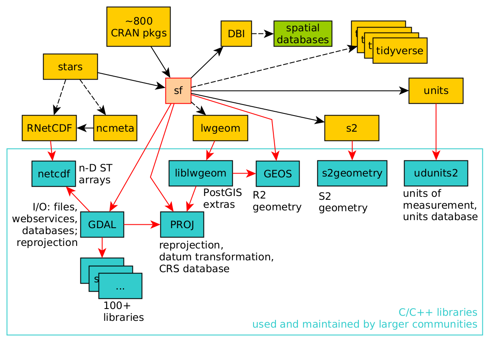

# (PART) Spatial Data {-}

# Getting Started {#intro}
 
This chapter introduces a number of concepts associated with
handling spatial data, and points forward to later sections where
they are discussed in more detail.  The code sections in this chapter
should be easy to follow when understanding R at the level of, say,
[R for Data Science](http://r4ds.had.co.nz/) [@r4ds].

## A first map

The typical way to graph spatial data is by creating a map. Let us consider
a simple map:

```{r first-map, fig.cap="a first map", eval=TRUE, echo=FALSE, fig=TRUE, cache=FALSE, message=FALSE}
library(tidyverse)
library(sf)
system.file("gpkg/nc.gpkg", package="sf") %>%
	read_sf() -> nc
nc.32119 <- st_transform(nc, 32119)
nc.32119 %>%
	select(BIR74) %>%
	plot(graticule = TRUE, axes = TRUE)
```
<details>
<summary style="color:blue;">Click for Code</summary>
```{r eval=FALSE}
library(tidyverse)
library(sf)
system.file("gpkg/nc.gpkg", package="sf") %>%
	read_sf() -> nc
nc.32119 <- st_transform(nc, 32119)
nc.32119 %>%
	select(BIR74) %>%
	plot(graticule = TRUE, axes = TRUE)
```
</details>

A number of graphical elements are present, in this case:

* polygons are drawn, and colored according to a variable `BIR74`, whose name is in the title
* a legend key explains the meaning of the colors, and has a certain _color palette_ and _color
breaks_, values at which color changes
* the background of the map shows curved lines with constant latitude or longitude (graticules)
* the axis ticks show the latitude and longitude values 

_Polygons_ are a particular form of _geometry_; spatial geometries
(points, lines, polygons, pixels) are discussed in detail in
chapter \@ref(geometries). Polygons consist of sequences of points,
connected by straight lines. How point locations of spatial data are
expressed, or measured, is discussed in chapter \@ref(cs). As can
be seen from figure \@ref(fig:first-map), lines of equal latitude
and longitude do not form straight lines, indicating that some
form of projection took place before plotting; projections are also
discussed in chapter \@ref(cs) and section \@ref(transform). 

The color values in figure \@ref(fig:first-map) are derived
from numeric values of a variable, `BIR74`, which has a
single value assocated with each geometry or _feature_. Chapter
\@ref(featureattributes) discusses such feature attributes, and the
way they can relate to feature geometries. In this case, `BIR74`
refers to birth counts, meaning counts _over the region_. This
implies that the count does not refer to a value associated with
every point inside the polygon, which the continuous color might
suggest, but rather measures an integral (sum) over the polygon.

Before plotting figure \@ref(fig:first-map) we had to read the data,
in this case from a file (section \@ref(reading)). Printing a data
summary for the first three records of three attribute variables
shows:

```{r first_ten, echo=FALSE}
nc %>% select(AREA, BIR74, SID74) %>% print(n = 3)
```
<details>
<summary style="color:blue;">Click for Code</summary>
```{r eval=FALSE}
nc %>% select(AREA, BIR74, SID74) %>% print(n = 3)
```
</details>

The printed output shows 

* the (selected) dataset has 100 features (records) and 3 fields (attributes)
* the geometry type is `MULTIPOLYGON` (chapter \@ref(geometries))
* it has dimension `XY`, indicating that each point will consist of 2 coordinate values
* the range of x and y values of the geometry
* the coordinate reference system is geographic, indicating that coordinates are degrees longitude and latitude, with reference to the `NAD27` datum (chapter \@ref(rs))
* the three selected attribute variables are followed by a variable `geom` of type `MULTIPOLYGON` with unit degrees that contains the polygon information

More complicated plots can involve facet plots with a map in each
facet, as shown in figure \@ref(fig:firstgather).

```{r firstgather,fig.cap="ggplot with facet maps", echo=FALSE, cache=FALSE}
year_labels = c("SID74" = "1974 - 1978", "SID79" = "1979 - 1984")
nc.32119 %>% select(SID74, SID79) %>% gather(VAR, SID, -geom) -> nc2
ggplot() + geom_sf(data = nc2, aes(fill = SID)) + 
  facet_wrap(~VAR, ncol = 1, labeller = labeller(VAR = year_labels)) +
  scale_y_continuous(breaks = 34:36) +
  scale_fill_gradientn(colors = sf.colors(20)) +
  theme(panel.grid.major = element_line(color = "white"))
```
<details>
<summary style="color:blue;">Click for Code</summary>
```{r eval=FALSE}
year_labels = c("SID74" = "1974 - 1978", "SID79" = "1979 - 1984")
nc.32119 %>% select(SID74, SID79) %>% gather(VAR, SID, -geom) -> nc2
ggplot() + geom_sf(data = nc2, aes(fill = SID)) + 
  facet_wrap(~VAR, ncol = 1, labeller = labeller(VAR = year_labels)) +
  scale_y_continuous(breaks = 34:36) +
  scale_fill_gradientn(colors = sf.colors(20)) +
  theme(panel.grid.major = element_line(color = "white"))
```
</details>

An interactive, leaflet-type map is obtained by
```{r cache=FALSE, echo=FALSE}
suppressPackageStartupMessages(library(mapview))
nc.32119 %>% mapview(zcol = "BIR74", legend = TRUE, col.regions = sf.colors)
```
<details>
<summary style="color:blue;">Click for Code</summary>
```{r eval=FALSE}
suppressPackageStartupMessages(library(mapview))
nc.32119 %>% mapview(zcol = "BIR74", legend = TRUE, col.regions = sf.colors)
```
</details>

## Raster and vector data

Polygon, point and line geometries are examples of _vector_ data:
point coordinates describe the "exact" locations that can be
anywhere. Raster data on the other hand describe data where values
are aligned on a _raster_, meaning on a regularly laid out lattice of
usually square pixels. An example is shown in figure \@ref(fig:ras).

```{r ras,echo=FALSE,fig.cap="raster maps: Landsat-7 blue band, with color values derived from data values (a), the top-left 10x10 sub-image from (a) with numeric values shown (b), three sample points (c), three sample areas (d)", message=FALSE}
library(stars)
par(mfrow = c(2, 2))
par(mar = rep(1, 4))
tif <- system.file("tif/L7_ETMs.tif", package = "stars")
x <- read_stars(tif)[,,,1]
image(x, main = "(a)")
image(x[,1:10,1:10], text_values = TRUE, border = 'grey', main = "(b)")
image(x, main = "(c)")
set.seed(131)
pts = st_sample(st_as_sfc(st_bbox(x)), 3)
plot(pts, add = TRUE, pch = 3, col = 'blue')
image(x, main = "(d)")
plot(st_buffer(pts, 500), add = TRUE, pch = 3, border = 'blue', col = NA, lwd = 2)
```
<details>
<summary style="color:blue;">Click for Code</summary>
```{r eval=FALSE}
library(stars)
par(mfrow = c(2, 2))
par(mar = rep(1, 4))
tif <- system.file("tif/L7_ETMs.tif", package = "stars")
x <- read_stars(tif)[,,,1]
image(x, main = "(a)")
image(x[,1:10,1:10], text_values = TRUE, border = 'grey', main = "(b)")
image(x, main = "(c)")
set.seed(131)
pts = st_sample(st_as_sfc(st_bbox(x)), 3)
plot(pts, add = TRUE, pch = 3, col = 'blue')
image(x, main = "(d)")
plot(st_buffer(pts, 500), add = TRUE, pch = 3, border = 'blue', col = NA, lwd = 2)
```
</details>

Vector and raster data can be combined in different ways; for instance we can query the raster at the three points of figure \@ref(fig:ras)(c), 
```{r raspts,echo=FALSE}
st_extract(x, pts)
```
<details>
<summary style="color:blue;">Click for Code</summary>
```{r eval=FALSE}
st_extract(x, pts)
```
</details>
or compute an aggregate, such as the average, over arbitrary regions such as the circles shown in figure \@ref(fig:ras)(d):
```{r rasbuffers,echo=FALSE}
aggregate(x, st_buffer(pts, 500), FUN = mean) %>% st_as_sf()
```
<details>
<summary style="color:blue;">Click for Code</summary>
```{r eval=FALSE}
aggregate(x, st_buffer(pts, 500), FUN = mean) %>% st_as_sf()
```
</details>

Other raster-to-vector conversions are discussed in \@ref(raster-to-vector) and include

* converting raster pixels in point values
* converting raster pixels into small polygons, possibly merging polygons with identical values (polygonize)
* generating lines or polygons that delineate continuous pixel areas with a certain value _range_ (contouring)


```{r vectoras,echo=FALSE,fig.cap="The map of figure 1.1 after rasterizing"}
plot(st_rasterize(nc["BIR74"], dx = 0.1), col =sf.colors(), breaks = "equal")
```
<details>
<summary style="color:blue;">Click for Code</summary>
```{r eval=FALSE}
plot(st_rasterize(nc["BIR74"], dx = 0.1), col =sf.colors(), breaks = "equal")
```
</details>

Raster-to-vector conversions can be as simple as rasterizing polygons, as shown in figure \@ref(fig:vectoras). Other, more general vector-to-raster conversions include

* interpolation of point values to points on a regular grid (chapter \@ref(interpolation))
* estimating densities of points over a regular grid (chapter \@ref(pointpatterns))
* area-weighted interpolation of polygon values to grid cells (section \@ref(areaweighted))
* direct rasterization of points, lines or polygons (section @\ref(rasterize))

## Time series, arrays, data cubes

A lot of spatial data is not _just_ spatial, but in addition temporal. Just like any observation is associated with an observation location, it is associated with an observation time or period. The dataset on the North Carolina counties shown above contains disease cases counted over two time periods, shown in figure \@ref(fig:firstgather). Although the original dataset has these variables in two different columns, for plotting them these columns had to be stacked first, while repeating the associated geometries - a form called _tidy_ by [@tidy]. When we have longer time series associated with geometries, neither option - distributing time over multiple columns, or stacking columns while repeating geometries - works well, and a more effective way of storing such data would be a matrix, where on dimension refers to time, and the other to space. The natural way for image or raster data is alreay to store them in matrices; time series of rasters then lead to a three-dimensional array. The general term for such data is a (spatiotemporal) **data cube**, where cube refers to arrays with any number of dimensions.  Data cubes can refer to both raster and vector data, examples are given in chapter \@ref(raster). 

## Support, attribute-geometry relationships

When we have spatial data with geometries that are not points but
collections of points (multi-points, lines, polygons, pixels), then
the attributes associated with these geometries may have a different
relationship to them. Attributes can

* have a **constant** value for every point of the geometry 
* have a value that is unique to only this geometry, describing its **identity**
* have a single value that is an **aggregate**  over all points of the geometry

An example of a constant may be land use or bedrock type of
a polygon. An example of an identity could be a county name. An
example of an aggregate could be the number of births over a given
period of time, of a county. 

This property is called **support**: aggregate properties have
block (or polygon, or line) support, constant properties have
point support (they apply to every point). Support matters when
we manipulate the data. For instance, figure \@ref(vectoras) was
derived from a variable that has polygon support: the number of
births per county. Rasterizing these values gives pixels with values
that are associated to counties.  The result of the rasterization
is a meaningless map: the numeric values ("birth totals") are not
associated with the raster cells, and the county boundaries are lost.
Totals of birth for the whole state can no longer be recovered from
the pixel values.  Ignoring support can easily lead to meaningless
results. Chapter \@ref(featureattributes) discusses this further.

## The Spatial Data Science software ecosystem

Although this book largely uses R and R packages for spatial data
science, a number of these packages actually use software libraries
that were not developed for R alone.  As an example, the dependency
of R package `sf` on other R packages and system libraries is shown
in figure \@ref(fig:gdal-fig-nodetails).

```{r gdal-fig-nodetails, out.width = '100%', echo=FALSE,fig.cap = "sf and its dependencies; arrows indicate strong dependency, dashed arrows weak dependency"}

```

The C or C++ libraries used (GDAL, GEOS, PROJ, liblwgeom, s2geometry,
udunits2) are all developed, maintained and used by data science
communities that are large and mostly different from the R community.
By using these libraries, we share how we understand what we
are doing with these other communities. Because R, Python and Julia
provide interactive interfaces to this software, many users get
closer to these libraries than do users of other software based on
these libraries. This is not only important for resolving problems,
but also for reaching consensus on which findings are helpful.

### GDAL

GDAL (geospatial data abstraction library) can be seen as the
Swiss army knive of spatial data; besides for R it is being
used in Python, QGIS, PostGIS, [and more than 100 other software
projects](https://trac.osgeo.org/gdal/wiki/SoftwareUsingGdal).

GDAL is a "library of libraries" -- in order to read all these data
sources it needs a large number of other libraries. It typically
links to over 100 other libraries. Binary packages distributed by
CRAN contain only statically linked code: CRAN does not want to
make any assumptions about presence of third-party libraries on the
host system. As a consequence, when the `sf` package is installed
in binary form from CRAN, it includes a copy of all the required
external libraries as well as their dependencies, which may amount
to 100 Mb.

### PROJ

PROJ is a library for cartographic projections and datum
transformations: it converts spatial coordinates from one coordinate
reference system to another. It comes with a large database of known
projections and access to datum grids (high-precision pre-calculated
values for datum transformations). It aligns with an international
standard for coordinate reference systems [@lott2015geographic].
Chapter \@ref(rs) details more about coordinate systems.

### GEOS and s2geometry

GEOS ("Geometry Engine Open Source") and s2geometry are two libraries
for geometric operations. They are used to find measures (length,
area, distance), and calculate predicates (do two geometries have
any points in common?) or new geometries (which points do these two
geometries have in common?). GEOS does this for flat, two-dimensional
space ($R^2$), s2geometry does this for geometries on the sphere
($S^2$). Chapter \@ref(cs) discusses more about the differences between
working with these two spaces.


## Exercises
1. What is the difference between raster and vector data?
2. Which components of a map can you list?
3. 
