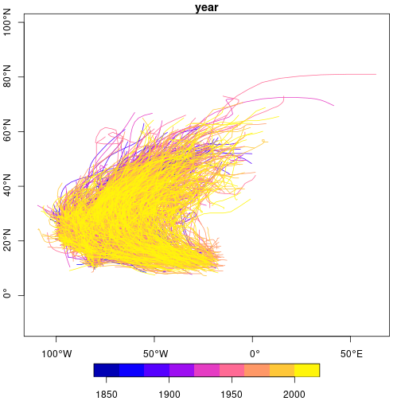
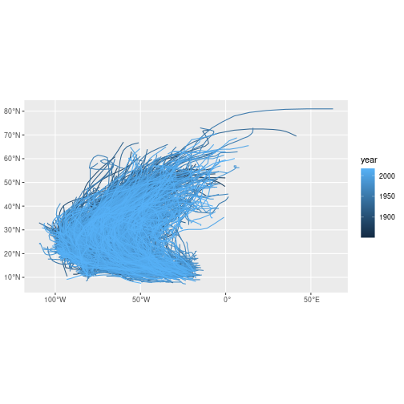
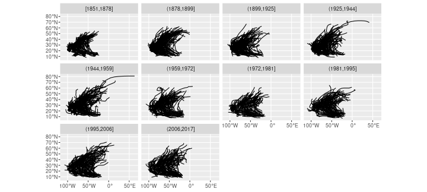
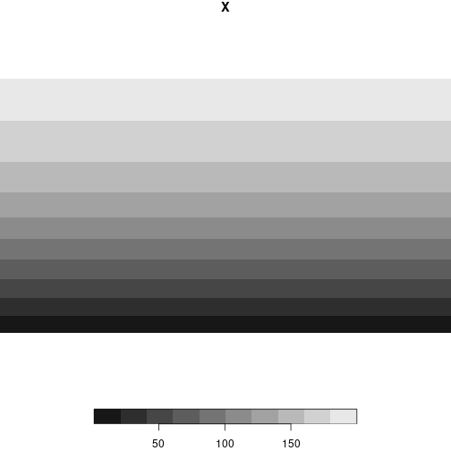
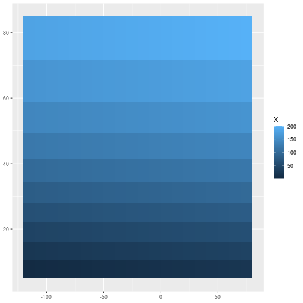
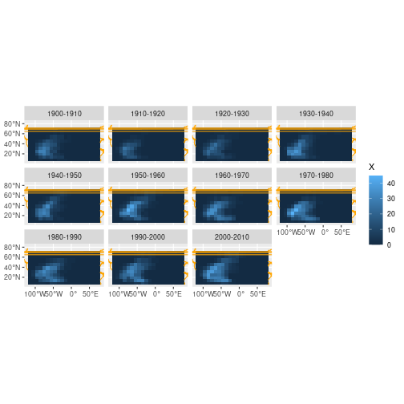

## R Markdown
Read the entire dataset in character strings, split by fields

```r
r0 = readLines("hurdat2-1851-2017-050118.txt")
r = strsplit(r0, ",")
rle = rle(lengths(r))
rle
```

```
## Run Length Encoding
##   lengths: int [1:3702] 1 14 1 1 1 1 1 49 1 16 ...
##   values : int [1:3702] 3 20 3 20 3 20 3 20 3 20 ...
```
group them by storm

```r
library(sf)
```

```
## Linking to GEOS 3.10.1, GDAL 3.4.0, PROJ 8.2.0; sf_use_s2() is TRUE
```

```r
from_to = matrix(cumsum(rle$lengths), , 2, byrow = TRUE)
n = nrow(from_to)
# n = 1000
grp = lapply(1:n, function(i) r0[(from_to[i,1]+1):from_to[i,2]])
nm = lapply(1:n, function(i) r0[from_to[i,1]])
f = tempfile()
l = lapply(grp,
			 function(x) {
			 		do.call(cat, c(list(x), sep = "\n", file = f)) # write
			 		df = read.csv(f, header = FALSE)
			 		y = as.character(df[[5]])
			 		yc = as.numeric(strsplit(y, "[NS]"))
			 		s = grep("S", y)
			 		yc[s] = -yc[s]
			 		x = as.character(df[[6]])
			 		xc = as.numeric(strsplit(x, "[EW]"))
			 		w = grep("W", x)
			 		xc[w] = -xc[w]
			 		if (length(xc) > 1)
			 			st_linestring(cbind(xc,yc))
			 		else
			 			st_point(c(xc,yc))
			 }
)
sfc = st_sfc(l, crs = 4326)
yrs = as.numeric(lapply(grp, function(x) substr(x[1], 1, 4)))
name = sub("[ ]*", "", sapply(nm, function(x) strsplit(x, ",")[[1]][2]))
sf = st_sf(year = yrs, name = name, sfc)
plot(sf["year"], axes = TRUE)
```




```r
library(ggplot2)
```

```
## Warning in (function (kind = NULL, normal.kind = NULL, sample.kind = NULL) :
## non-uniform 'Rounding' sampler used
```

```r
ggplot() + geom_sf(data = sf, aes(col = year))
```




```r
sf$year_grp = cut(sf$year, quantile(sf$year, (0:10)/10),
    dig.lab=4, include.lowest = TRUE)
ggplot() + geom_sf(data = sf) + facet_wrap(~year_grp)
```



# use stars for rectilinear grid

```r
library(stars)
```

```
## Loading required package: abind
```

```r
x = c(seq(-120, 60, 10), 70.1)
# y = seq(85, 5, -10)
y = asin(seq(.087, .95, length.out = 10)) * 180 / pi
d = st_dimensions(x = x, y = y, .raster = c("x", "y"))
st = st_as_stars(matrix(1:200, 20, 10), dimensions = d)
st_crs(st) = 4326
plot(st)
```



```r
suppressPackageStartupMessages(library(ggplot2))
ggplot() + geom_stars(data = st)
```




```r
suppressPackageStartupMessages(library(tidyverse))
```

```
## Warning in (function (kind = NULL, normal.kind = NULL, sample.kind = NULL) :
## non-uniform 'Rounding' sampler used
```

```r
grd = st_as_sf(st, as_points = FALSE)
yr = seq(1900, 2010, 10)
m = array(NA_real_, c(20, 10, length(yr)-1))
for (i in 1:(length(yr)-1)) {
	storms <- sf %>% filter(year >= yr[i], year < yr[i+1])
	int = st_intersects(grd, storms)
	m[,,i] = matrix(lengths(int), 20, 10)
}
f = st_as_stars(m, dimension = 
						 	st_dimensions(x = x, y = y, year = yr, .raster = c("x", "y")))

library(rnaturalearth)
ne = st_cast(ne_countries(returnclass = "sf"), "MULTILINESTRING")
st_crs(f) = st_crs(ne)
bb = st_bbox(f)
bb[4] = 83
ne = st_intersection(st_as_sfc(bb), ne)
lyr = function(labels, multiline) { 
	y = as.numeric(labels[[1]])
	list(year = paste(y,y+10,sep="-"))
}
ggplot() + geom_stars(data = f) + coord_equal() + 
	facet_wrap(~year, labeller = lyr) +
	geom_sf(data = ne, col = 'orange') +
	xlim(bb[1],bb[3]) + ylim(bb[2], bb[4])
```

```
## Coordinate system already present. Adding new coordinate system, which will replace the existing one.
```

```
## Warning: Removed 220 rows containing missing values (geom_rect).
```



```r
#save.image()
```


```r
library(viridis)
```

```
## Loading required package: viridisLite
```

```r
ggplot() + geom_stars(data = f) + #coord_equal() +
    facet_wrap(~year, labeller = lyr) +
    geom_sf(data = ne, col = '#ff880044') +
    #xlim(bb[1],bb[3]) + ylim(bb[2], bb[4]) +
      scale_fill_viridis() +
    scale_x_discrete(expand=c(0,0)) + scale_y_discrete(expand=c(0,0))
```

```
## Error: Scale limits cannot be mapped onto spatial coordinates in `coord_sf()`.
## Consider setting `lims_method = "geometry_bbox"` or `default_crs = NULL`.
```


